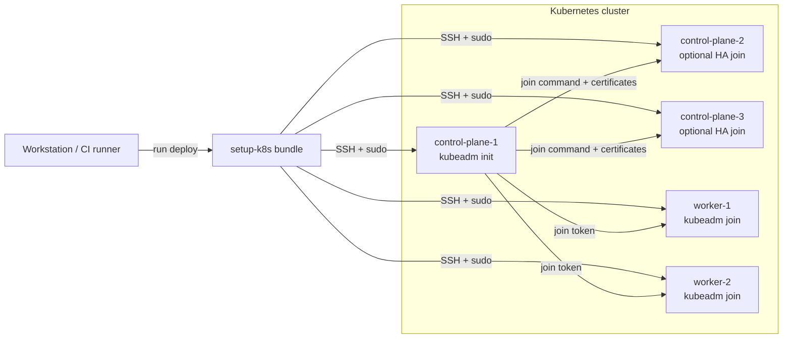

# Remote Deploy

Use the `deploy` subcommand when you want to create a multi-node cluster from one local orchestrator machine.

The orchestrator does not need local root privileges. Remote nodes need SSH access with sudo.

## Deployment model

Run `setup-k8s.sh deploy` from your workstation or automation host. The script connects to each node over SSH, uploads a self-contained bundle, initializes the first control-plane node, then joins the rest of the cluster.



## Basic deployment

```bash
curl -fsSL https://github.com/MuNeNiCK/setup-k8s/raw/main/setup-k8s.sh | sh -s -- \
  deploy \
  --control-planes root@192.168.1.10 \
  --workers root@192.168.1.11,root@192.168.1.12 \
  --ssh-key ~/.ssh/id_rsa
```

## How it works

1. Checks SSH connectivity and sudo access.
2. Generates a self-contained setup bundle.
3. Transfers the bundle to each node.
4. Initializes the first control-plane node.
5. Joins additional control-plane nodes when configured.
6. Joins workers in parallel.
7. Runs health checks after deployment.

## HA deployment

Pass `--ha-vip` with multiple control-plane nodes:

```bash
curl -fsSL https://github.com/MuNeNiCK/setup-k8s/raw/main/setup-k8s.sh | sh -s -- \
  deploy \
  --control-planes root@192.168.1.10,root@192.168.1.11,root@192.168.1.12 \
  --workers root@192.168.1.20 \
  --ha-vip 192.168.1.100 \
  --ssh-key ~/.ssh/id_rsa
```

See [High Availability](high-availability.md) for kube-vip behavior and requirements.

## Authentication

Key-based SSH:

```bash
setup-k8s.sh deploy \
  --control-planes root@192.168.1.10 \
  --ssh-key ~/.ssh/id_rsa
```

Password file:

```bash
setup-k8s.sh deploy \
  --control-planes root@192.168.1.10 \
  --ssh-password-file /run/secrets/ssh-pass
```

The password file must have mode `0600` or stricter.

## Resume interrupted deployments

```bash
setup-k8s.sh deploy \
  --resume \
  --control-planes root@192.168.1.10,root@192.168.1.11 \
  --workers root@192.168.1.20 \
  --ssh-key ~/.ssh/id_rsa
```

State is persisted to `/var/lib/setup-k8s/state/`. Completed steps are skipped on resume.
